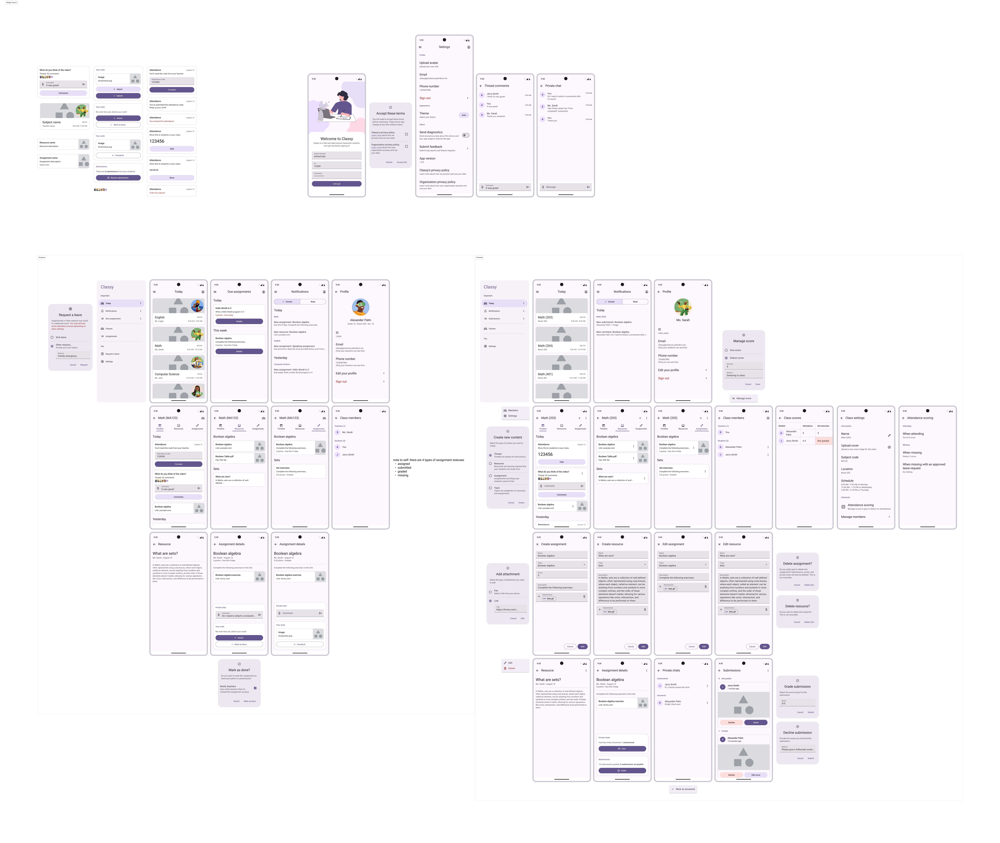

# Classy Design Progress

[**👋🏻 Figma file here!**](https://www.figma.com/design/gExw6OWSHfpdTFB5g34f6c/Classy-app?node-id=57795-3045&t=9NMYePg1uCiOFj6N-0)

  
Image preview

  

This repository is made to track design progress of the Classy app.  
Each commit will include a Figma link of that specific version and screenshots of what is changed.

This is made for the [Hack Club Arcade event](https://hackclub.com/arcade).

## ❔ But... what is Classy?

Classy will be a fully open-source classroom system that schools can host themselves for free.

## 🤔 Why Classy exists?

Other classroom solutions being used at my school feels off. It's either missing a few features or it isn't really designed for mobile.

## ✨ What features will it have?

- Class schedules for both students and teachers
- Resources and assignments
- Scoring system
- Requesting a leave for students
- Due assignment reminders for students
- _Partially_ automatic attendance system (gives scores automatically too)

## 😀 Alright, I'm convinced

Thank you for reading! I've really been wanting to make useful projects for a while now. I might even try my luck and present this to my own school!  
If you're a Hack Club staff, thank you for encourging students to do cool things like this!
